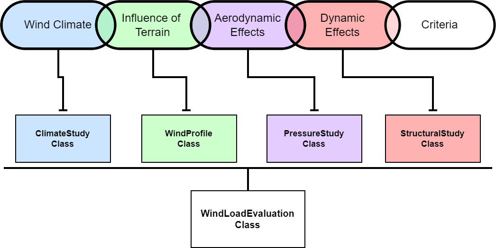

# OpenWLE: An open-source workflow for the computational wind load evaluation of tall buildings

Data and Code for the paper: [Insert Paper Link] 

This workflow presents the structural wind load evaluation analysis process for tall buildings. The framework is designed using methodology found in wind tunnel testing but is capable of being applied for computational-based wind loading studies using CFD.
Each step within the wind load evaluation pipeline is outlined along with the related background details.
The modular design of the framework allows for easier modification and introduction of new evaluation methodology.



## Application requirements
The proposed workflow is developed using Python for easy readability and adoption with other workflows. The current version of the workflow has been tested using Python `3.11.9`. The required libraries are provided in the `requirement.txt` file found within the repository.

## Citing
The development of this workflow is part of the following article. We would greatly appreciate it if you would please cite the following paper if you found the workflow useful for your work.
```
@articile{howlett2025bitsuamlak,
  title = {An open-source computational wind load evaluation workflow for tall building design},
  author = {Howlett, Christopher J. and Bitsuamlak, Girma T.},
  journal = {Advances in Engineering Software},
  volume = {215},
  pages = {104117},
  year = {2026},
  publisher = {Elsevier},
  doi = {https://doi.org/10.1016/j.advengsoft.2026.104117}
}
```
